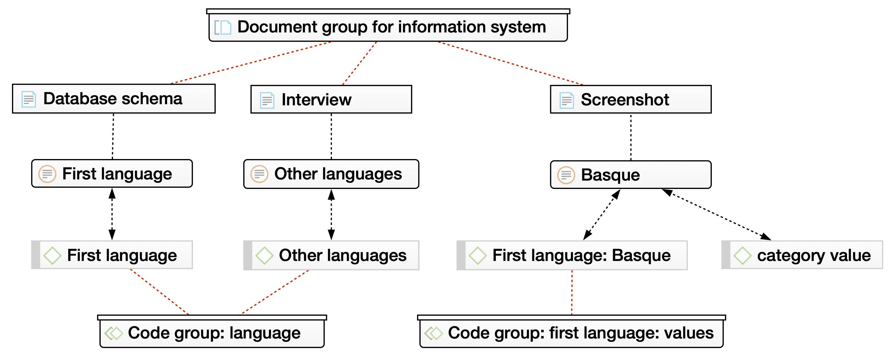
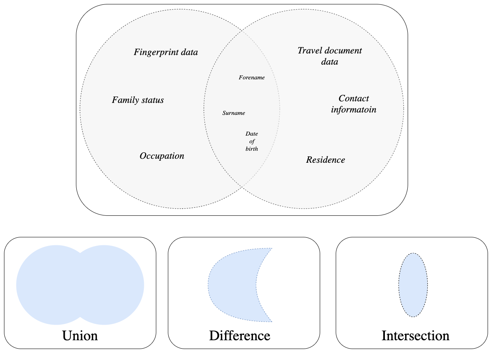
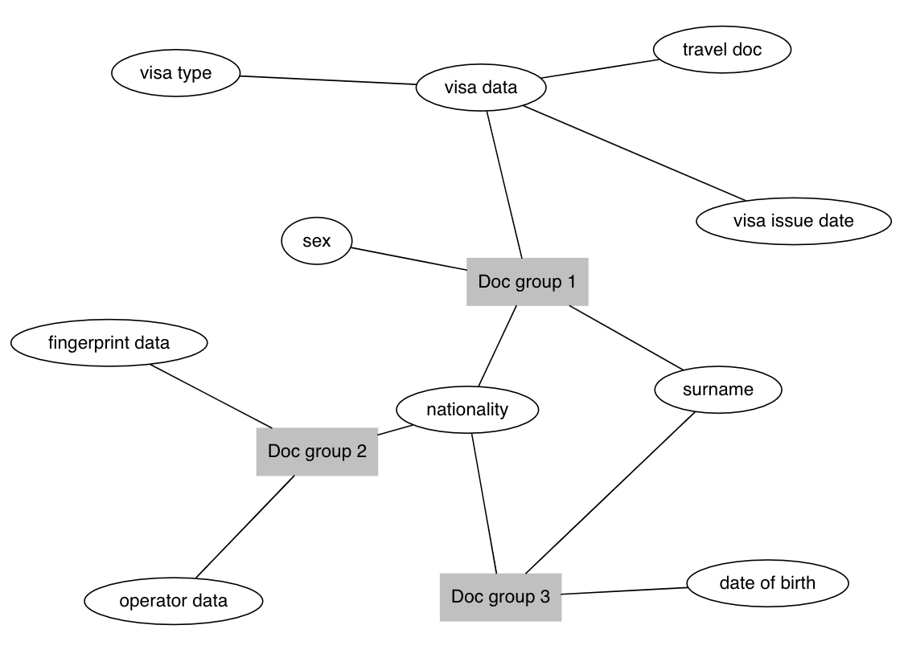
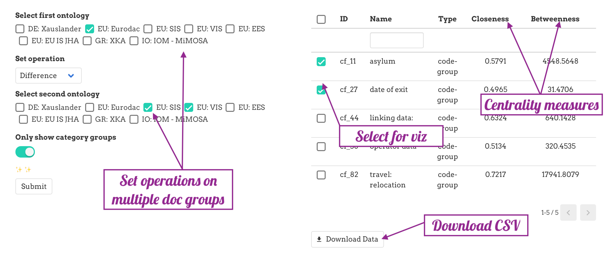

```{r setup, include=FALSE}
knitr::opts_chunk$set(echo = FALSE)
```

## Border crossing & visibility

> "We need to know who is crossing our borders ... By November we will propose a European travel information system --- an automated system to determine who will be allowed to travel to Europe. That way we will know who is travelling to Europe before they even get here." (President of the European Commission J.C. 2016)

* Preoccupation of European policy makers to **make known presumed invisible phenomena of border crossings** at borders of Europe.

* **Issue of visibility** often associated to migration and border management.

* Less attention given to the **data infrastructures** in management of mobility, migration and borders.

## Importance

* Importance of understanding **how data infrastructures at border zones enact people on the move**

* Processing Citizenship & contribution to "alterity processing" (Pelizza 2020) framework:

  + studying the possibilities and constraints for people on the move, by the way people are enacted while entering Europe,

  + by **focusing on the ontologies** in the information systems deployed at borders.

  + contribute to the script analyses.

## Studies of classification systems

* Building on studies about **ontologies, standards, and classification systems**, e.g. Bowker & Star "Sorting things out" (1999), Evelyn Ruppert, Ian Hacking

* Lack of clear **methodological contributions** for studying data models.

* Under developed area in field of migration and border studies.

## Authorities & information systems

* EU authorities:
  + Eurodac
  + Schengen Information System
  + Visa Information System

* Greek authorities, _Hellenic Register of Foreigners (XKA)_
  + Used at border zones in Greece to identify and register persons who arrive at the border
  + Used by Police, administrative personnel and asylum officers to input and retrieve migrants' biographic and biometric data
  + Integrates with other EU information systems

* German authorities, XAusländer
  + Data format for data exchange between the immigration authorities in Germany


<!-- |                     |   |   |
|-----------------------------|---|---|
| Eurodac                      | Determining asylum application responsibility | Fingerprint data |
| Schengen Information System | External border control and law enforcement cooperation | Alerts on persons and objects |
| Visa Information System     | Common EU visa policy, prevent visa fraud  | Visa data exchange  | -->

## Building a method and a tool to visualize data infrastructures for migration management

Three steps in building our method:

* Data coding
  + preliminary in vivo coding,
  + code harmonization,
  + document grouping,
  + value coding
* Data analysis
* Data visualization and indicators

## Data coding (1)

```{r data, out.width='65%', fig.align='center', echo=FALSE, fig.cap=""}
knitr::include_graphics("../../figures/data-types.png")
```

## Data coding (2)

```{r fig, out.width='80%', fig.align='center', echo=FALSE, fig.cap="An example of the technique for coding data. From top to bottom there are four levels, one for each type of element: document group, document, quote, code, code group."}

```

## Data analysis

Based on three analytical categories:

1. **Presence** & **absence**
   + Whether a category or value used in one system is also present in another system.
   + Example, is the category "profession" that is present in the Hellenic Register of Foreigners also present in other system?
2. **Particularity**
   + Whether some categories are native or peculiar to a specific system.
   + For example, are categories "_date of registration in the system_" or "_system ID_" only proper of Eurodac, or are they also used in other system?
3. **Frequency**
   + In which systems specific categories and values occur more frequently.
   + For example, is the category "country of origin" mostly used on European databases like Eurodac and SISII, or evenly used across European and national databases?

## Data visualization and indicators

First we create a graph, with nodes and link based on occurrences of categories.

```{r venn, out.width='50%', fig.align='center', echo=FALSE, fig.cap="The different set operations."}

```

## Illustrating potential uses

Some illustrations of potential uses of the method.

### Presence and absence, code groups

```{r code = readLines("../presence_matrix_eu.R"), echo = FALSE}
```

```{r authorities, ft.align="center", tab.cap='Presence of code groups for EU (Eurodac, SIS, VIS), Greek (XKA), German (XAüslander).'}
ft
```

In the tool:

```{r explorer, out.width='50%', fig.align='center', echo=FALSE, fig.cap=""}
knitr::include_graphics("../../figures/explorer.png")
```

## Presence and absence, categories

```{r code = readLines("../presence_matrix_eu_codes.R"), echo = FALSE}
```

```{r codes, ft.align="center", tab.cap='Presence of categories for EU (Eurodac, SIS, VIS), Greek (XKA), German (XAüslander).'}
ft
```

## Frequency & centrality

### Example

```{r example, out.width='50%', fig.align='center', echo=FALSE, fig.cap="Example of centrality, comparing degree and betweenness centrality."}

```

### Illustrative case

```{r code = readLines("../frequency_table.R"), echo = FALSE}
```

```{r frequencies, ft.align="center", tab.cap='Frequency table for code groups present in all systems.'}
ft <- theme_booktabs(ft)
ft
```

## Questions / comments?

```{r interface, out.width='70%', fig.align='center', echo=FALSE, fig.cap=""}

```
