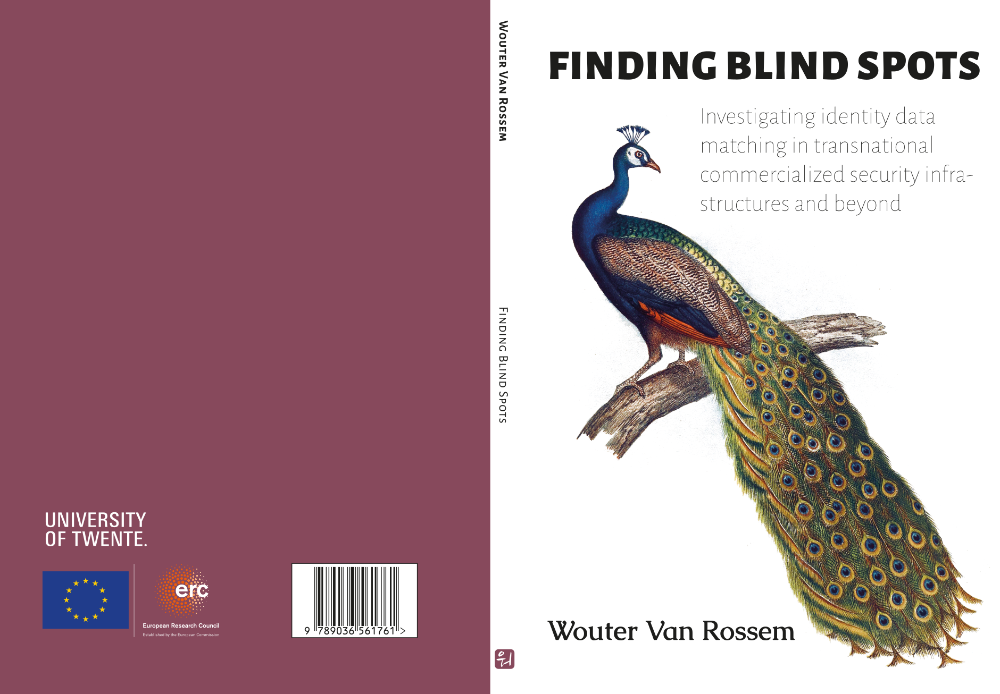

--- 
### Title page
title: "Finding blind spots"
subtitle: "Investigating identity data matching in transnational commercialized security infrastructures and beyond" # The main title of your thesis (not including possible subtitles)
# subtitle: |
  # | Investigating identity data matching  
  # | in transnational security infrastructures and beyond
# (can also be  omitted if you don't have a subtitle)
author: "Wouter Rudi Van Rossem" # Your full name (including middle names if applicable)
date: "" # Your defense date in Dutch: "[weekday] [day in numerics] [name of month] [year]"
aula: # set to true if your defense is in the Aula; set to false/omit if it is in the Agnietenkapel
time: "12:45" # time of your defense (a 24h time, e.g. "14.00")
birthplace: "Brussel" # your place of birth, in Dutch
country_of_birth: "België" # if your birthplace is not in the Netherlands, fill in the country as well (in Dutch). Omit otherwise!

### Colophon 
# Can be skipped entirely, but if you define FUNDER, this will read: 
# "The investigations in this thesis were supported by [a] GRANT [from] FUNDER"
grant: "grant agreement No 714463" # optional, otherwise this bit is omitted
funder: "the European Research Council (ERC) under the European Union's Horizon 2020 research and innovation program"

# This paragraph begins with "This thesis was typeset using (R) Markdown, \LaTeX\ and the \verb+bookdown+ R-package"
# and is optionally followed by:
ISBN1: "978-90-365-6176-1" # optional, otherwise this bit is omitted
ISBN2: "978-90-365-6177-8" # optional, otherwise this bit is omitted
printing: "" # optional, otherwise this bit is omitted
cover: "Wouter Rudi Van Rossem" # optional, otherwise this bit is omitted
DOI: "10.3990/1.9789036561778"

# Can be skipped entirely, but if you define THESIS_URL, this will read: 
# "An online version of this thesis is available at THESIS_URL [,licensed under a LICENSE.]
thesis_url: ""
license: "CC BY-NC-SA 4.0" # optional, otherwise this bit is omitted

### Committee
# Fill in each of your "promotores" below, corresponding to the form you submitted to the graduate school.
# Copy-paste the 4 subfields (starting with " - title:") if you have more than two, or delete one entry if you have only one promotor.
promotores: 
# for example:
- title: prof. dr. # either "prof.dr" for full professors, or "dr." for others
  initials: S.
  surname: Kuhlmann
  affiliation: Universiteit Twente, BMS, Knowledge, Transformation \& Society
# - title: prof. dr.
#   initials: H.
#   surname: Jones
#   affiliation: University of Indiana
one_promotor: true # set to true if you have only 1 promotor. Then the heading will be "Promotor" (singular), instead of "Promotores".
# Fill in each of your "copromotores" below, corresponding to the form you submitted to the graduate school.
# If you don't have a copromotor, simply delete the fields ("copromotores" and its 4 subfields)
copromotores:
- title: prof. dr. 
  initials: A.
  surname: Pelizza
  affiliation: University of Bologna 
- title: prof. dr. ir.
  initials: M.
  surname: van Keulen
  affiliation: University of Twente, EEMCS, Datamanagement \& Biometrics
one_copromotor: false # if true the heading will be "Copromotor" (singular), instead of "Copromotores" (assuming there is a copromotor)
# Fill in each of your committee members below, corresponding to the form you submitted to the graduate school.
# Copy-paste the 4 subfields (starting with " - title:") as many times as you have committee members.
members:
- title: prof. dr.
  initials: M.
  surname: de Goede
  affiliation: University of Amsterdam, Faculty of Humanities
- title: dr.
  initials: K.E.
  surname: Konrad
  affiliation: University of Twente, BMS, Knowledge, Transformation \& Society
- title: prof. dr.
  initials: A.
  surname: Rotolo
  affiliation: University of Bologna, Department of Legal Studies
- title: prof. dr.
  initials: R.
  surname: Torenvlied
  affiliation: University of Twente, BMS, Public Administration
- title: prof. dr.
  initials: R.
  surname: Williams
  affiliation: University of Edinburgh, Institute for the Study of Science, Technology and Innovation (ISSTI)
# Finally, the (Dutch) name of your faculty, e.g. "Faculteit der Maatschappij- en Gedragswetenschappen"
faculty: Faculty of Behavioural, Management & Social Sciences

### Book settings
documentclass: book # default LaTeX book class
book_size: true # "true" if you want to render a pdf for printing as a book; "false" if you want to print loose pages
           # if book_size is set to false, forces A4 paper size, and the "oneside" classoption
           # if book_size is set to true, forces standard "thesis B5 size" (170mm wide by 240mm high), and the "twoside" classoption
geometry: "inner=25mm, outer=20mm, top=25mm, bottom=20mm, twoside=true" # use this if you want to change the margins
            # 2.5cm equal margins are often recommended by printers (so when book_size: true)
fontsize: 10pt # 12pt is recommened when book_size is false; 10 or 11pt is recommended when book_size is true
lang: en-US # default language for the thesis. Change to en-GB or en-US if you want a specific flavor of English (or to nl for Dutch)
site: bookdown::bookdown_site # to get a "Build" button in RStudio to render the book

indent: true # indent new paragraphs, instead of leaving whitespace
links-as-notes: false # in the pdf, print hyperlink URLS as footnotes (as they can't be clicked on)
bibliography: /home/woutervr/Surfdrive/ZoteroBibtex.bib # bib-file containing bibliographic information on all works you want to cite
biblio-style: "style/sage/sageh"
biblio-title: "List of references"
link-citations: true # make clickable hyperlinks from in-text citations to bibliography at the end

header-includes:
  - \usepackage{booktabs}
  - \usepackage{longtable}
  - \usepackage{array}
  - \usepackage{multirow}
  - \usepackage{wrapfig}
  - \usepackage{float}
  - \usepackage{colortbl}
  - \usepackage{pdflscape}
  - \usepackage{tabu}
  - \usepackage{threeparttable}
  - \usepackage{threeparttablex}
  - \usepackage[normalem]{ulem}
  - \usepackage{makecell}
  - \usepackage{xcolor}
  - \usepackage{xurl}
  - \usepackage[doipre={DOI:~}]{uri}
  - \usepackage{ragged2e}
  - \usepackage{setspace}
  - \usepackage{fancyhdr}
  - \usepackage{tabularx}
subparagraph: yes
always_allow_html: true
print_version: false
---

```{r include=FALSE}
# Set Knitr options
knitr::opts_chunk$set(echo = FALSE)
knitr::opts_chunk$set(fig.width=3, fig.height=2) 

# Load dependencies
library(kableExtra)
library(flextable)
library(officer)
library(officedown)
library(pander)
library(dplyr)

# Set global variables
DATA_PATH = file.path(getwd(), "data")
TABLES_PATH = file.path(getwd(), "tables")

# Determine the output format
OUTPUT_FORMAT = knitr::opts_knit$get("rmarkdown.pandoc.to")

# Default properties for officer tables
pt <- prop_table(
  width = table_width(),
  style = "Table",
  align = "center", 
)

panderOptions('table.alignment.default', "left")

set_flextable_defaults(align = "left", part = "all")
set_flextable_defaults(valign = "top", part = "all")

doAnonymize = FALSE
usePlaceholderFigures = FALSE

placeholderCaption = ""

anonymize <- function(text) {
  if (doAnonymize) {
    "[_edit_]"
  } else {
    text
  }
}

anonymizeQuotation <- function(text) {
  if (doAnonymize) {
    "(_edit_)"
  } else {
    text
  }
}
```

`r if (knitr:::is_html_output()) '
# Preface {-}
'`

```{r echo=FALSE, fig.align='center', include = knitr::is_html_output()}

```

```{r, echo=FALSE, results='asis'}
if (knitr::is_html_output()) {
  cat("
This PhD project was conducted under the supervision of Prof. Dr. [Stefan Kuhlmann](https://orcid.org/0000-0001-8673-511X), Prof. Dr. [Annalisa Pelizza](https://orcid.org/0000-0002-7720-5659) and Dr. Ir. [Maurice van Keulen](https://orcid.org/0000-0003-2436-1372) at the department of technology, policy and society (TPS), section [Knowledge, Transformation, and Society (KiTeS)](https://www.utwente.nl/en/bms/kites/), Faculty of Behavioural, Management and Social Sciences (BMS), University of Twente.

The investigations in this dissertation were conducted within the context of the “Processing Citizenship: Digital registration of migrants as co-production of citizens, territory and Europe” project, which has received funding from the European Research Council under the European Union’s Horizon 2020 research and innovation programme under grant agreement No 714463.

© 2024 Wouter Rudi Van Rossem, Enschede, The Netherlands and Bologna, Italy. This workis licensed under the Creative Commons Attribution-NonCommercial-ShareAlike 4.0 International License. To view a copy of this license, visit <http://creativecommons.org/licenses/by-nc-sa/4.0/>. No parts of this dissertation may be reproduced, stored in a retrieval system or transmitted in any form or by any means for commercial purposes without permission of the author. If you remix, transform, or build upon the material,you must distribute your contributions under the same license as the original.

<p><a href='http://creativecommons.org/licenses/by-nc-sa/4.0/'></a><a href='https://doi.org/10.3990/1.9789036561778'> </a></p>
")
}
```
